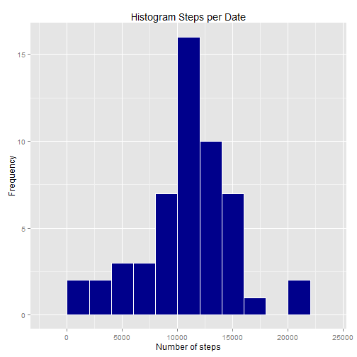
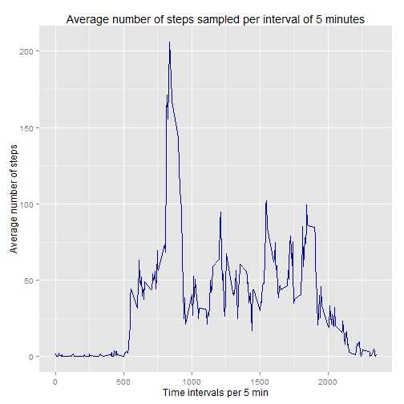
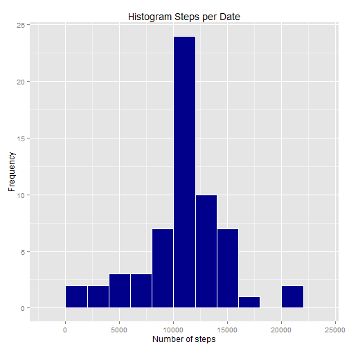
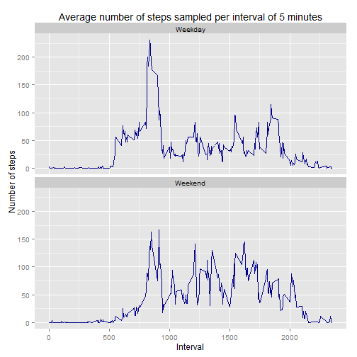

## Introduction
This is the report created for the Peer Assessment 1 assignment for the course Reproducible Research on Coursera. 

Assignment description:
This assignment makes use of data from a personal activity monitoring device. This device collects data at 5 minute intervals throughout the day. The data consists of two months of data from an anonymous individual collected during the months of October and November, 2012 and include the number of steps taken in 5 minute intervals each day.
- Dataset: Activity monitoring data [52K]

The variables included in this dataset are:
- steps: Number of steps taking in a 5-minute interval (missing values are coded as NA)
- date: The date on which the measurement was taken in YYYY-MM-DD format
- interval: Identifier for the 5-minute interval in which measurement was taken
The dataset is stored in a comma-separated-value (CSV) file and there are a total of 17,568 observations in this dataset.


Before start to analyzing the data it is important to set the working directory that contain the dataset needed for the analysis. It can be done with the below function.

```r
setwd("~/R_Data/04 Reproducible Research/Project_1/")
```

## Part 1: Loading and preprocessing the data 
In order to run the analysis script the following to packages are needed.

```r
require(ggplot2)
require(data.table)
```

The dataset is read and loaded with the following instruction. In the case that the dataset is not unzipped the following code will unzipped it. 


```r
if (!file.exists("activity.csv")) {
    unzip("repdata-data-activity.zip")
}
dataset <- read.csv("activity.csv")
```

To facilitated further analysis the column that contain the date is converted to a date class. This will be helpful to identify the day of the week.


```r
dataset$date<- as.Date(dataset$date) 
```

## Part 2: What is mean total number of steps taken per day?
First the total number of steps taken per day is calculated. The following function was used to calculate the total number of steps taken per day. This function will ignore the missing values in the dataset that are scripted as NA.


```r
stepsXDate<- aggregate(steps ~ date, data=dataset, FUN=sum, na.rm=TRUE)
```

The bellow figure shows a histogram of the total number of steps taken each day.


```r
ggplot(stepsXDate, aes(x=steps)) + 
    geom_histogram(colour="white", fill="darkblue", binwidth = 2000) +
    labs(title="Histogram Steps per Date", x="Number of steps", y="Frequency")
```

 

The mean and median of the total number of steps taken per day are calculated bellow.


```r
meanStepXDate<-mean(stepsXDate$steps)
medianStepsXDate<-median(stepsXDate$steps)
```
mean = 1.0766189 &times; 10<sup>4</sup>
median = 10765

## Part 3: What is the average daily activity pattern?
The figure bellow shows a time series plot of the 5-minute interval and the average number of steps taken, averaged across all days. 
The average of steps per interval is calculated with the bellow algorithm. This dataset will be used to create the plot of the 5-minute interval and the average number of steps taken, averaged across all days.


```r
stepsXInterval <- aggregate(steps ~ interval, data=dataset, FUN=mean)
ggplot(stepsXInterval, aes(x=interval, y=steps)) +
    geom_line(colour="darkblue") + 
    labs(title="Average number of steps sampled per interval of 5 minutes", 
         x="Time intervals per 5 min", y="Average number of steps")
```

 

The 5-minute interval, on average across all the days in the dataset that contains the maximum number of steps is calculated bellow.


```r
stepsXInterval[stepsXInterval$steps == max(stepsXInterval$steps), 1]
```

```
## [1] 835
```

## Part 4: Imputing missing values
The total number of rows with missing values (NAs) is calculate bellow.


```r
rowsNA<-sum(!complete.cases(dataset))
```
number of rows with NAs values: 2304

The strategy employ in this analysis for filling in all of the missing values in the dataset is used the average steps per interval to substitute the NAs steps values. For example if the observation occurred in the 10 interval and has a missing value on the steps variable this value will be substitute with the average steps for the 10 interval. 

A dataset that contains all the rows with missing values is created. Then the missing values on this dataset are substitute with the average steps per interval calculated on previously. 


```r
naStepsData<-dataset[is.na(dataset$steps),]
meanSteps<-merge(naStepsData, stepsXInterval, by="interval")[,c(4,3,1)]
setnames(meanSteps, "steps.y", "steps")
```

A new dataset is created by making a row biding of the completed cases on initial dataset and the dataset just created with missing values filled in with the average steps per interval.  


```r
newDataset<-rbind(dataset[complete.cases(dataset),], meanSteps)
```

The following function was used to calculate the total number of steps taken per day on the new dataset.


```r
stepsXDateSubNAs<- aggregate(steps ~ date, data=newDataset, FUN=sum)
```

The figure bellow shows a histogram of the total number of steps taken each day.


```r
ggplot(stepsXDateSubNAs, aes(x=steps)) + 
    geom_histogram(colour="white", fill="darkblue", binwidth = 2000) +
    labs(title="Histogram Steps per Date", x="Number of steps", y="Frequency")
```

 

The mean and median of the total number of steps taken per day were calculated and show bellow.


```r
meanStepXDateSubNAs<-mean(stepsXDateSubNAs$steps)
medianStepsXDateSubNAs<-median(stepsXDateSubNAs$steps)
```
mean = 1.0766189 &times; 10<sup>4</sup>
median = 1.0766189 &times; 10<sup>4</sup>

The mean and median values calculated on this part are pretty similar to the values calculated on part 2. Since the average steps per interval were used to fill in the missing values the mean was not affected. Due to the increase on valid observations the histogram shows an increase on occurrence per bin but looks similar to previous plot.  

## Part 5: Are there differences in activity patterns between weekdays and weekends?
For the following calculation the dataset with the filled-in missing values was used. The weekdays() function was used to create a new factor variable in the dataset with two levels  "Weekday" and "Weekend" indicating whether a given date is a weekday or weekend day.


```r
newDataset$days <- as.factor(ifelse(weekdays( newDataset$date) %in% 
                                        c("Saturday","Sunday"), "Weekend", "Weekday")) 
```

The following algorithm calculate the average steps taken per interval.


```r
stepsXIntervalSubNAs <- aggregate(steps ~ interval + days, data=newDataset, FUN=mean)
```

A panel plot containing a time series of the 5-minute interval and the average number of steps taken, averaged across all weekday days or weekend days was created with following code.


```r
ggplot(stepsXIntervalSubNAs, aes(x=interval, y=steps)) +
    geom_line(colour="darkblue") + 
    facet_wrap(~days, ncol=1) +
    labs(title="Average number of steps sampled per interval of 5 minutes", 
         x="Interval", y="Number of steps")
```

 

The previous plot shows that in the weekend people are more active. Leading to think that the majority of them have a sedentary job. 
